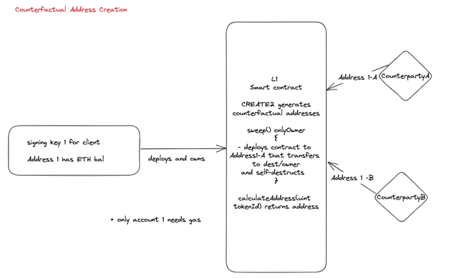

# Counterfactual Wallets

Contract suite to faciliate counterfactual wallet creation and management.

## Lifecycle:

A CounterfactualWalletController is deployed for an EOA (`0xA`) funded with ETH.

ERC20/721 and Ether can be sent to any counterfactual addresses associated with this contract.

These can be calculated using the function `computeAddress(walletId)` where `walletId` is a nonce of choice, typically increasing monotonically from zero. This address is communicated out of bands to a counterparty.

Later, `0xA` can _sweep_ the funds received at these counterfactual addresses to a destination of their choice.

For example:

1. `0xA` calculates counterfactual address `0xA1` with `walletId` = 1
1. `0xA1` sends this address to counter party B (address `0xB`)
1. `0xB` sends 100 USDC to `0xA1`
1. `0xA` _sweeps_ `0xA1` to a destination address `0xZ` by calling `sweep(walletId = 1, destination = 0xZ, [erc20 = usdc address, amount = 100], [])`

### Goerli Testnet Example:
1. Mintable ERC20 token @ https://goerli.etherscan.io/token/0x66ee871f085b93eb37f95d135774eff4d402e694#writeContract
1. Deployed CFWController @ https://goerli.etherscan.io/address/0x19B1054C5A5a7BcF4f64B325727cb39C8d946007#code
1. Calculate associated address for walletId = 1  = https://goerli.etherscan.io/address/0x0786fE42865Cbde3db1b1990852e75ADDda33ed5
1. Send 10 mintable ERC20 token above to this address https://goerli.etherscan.io/tx/0x64001e31b38cd4497008056fdb77eab4bd6efd328b0aea6920f3c12494f78068
1. Sweep these tokens to another random address 0xB3925cC4446635D2E3AdfB050cDa950d720167a0 https://goerli.etherscan.io/tx/0x57826ccff214e1e8edcaf31457f5a579b03c1bbad5ccc2727b2d3b751a5d662e
 


### Under the hood

A minimal proxy factory is used to create (CREATE2) a CounterfactualWallet which is then swept for ERC20, ERC721 or Ether to a target address specifed.
The contract is then destroyed within the same transaction.

An ERC20 transfer which usually costs 50k gas now costs 130k (:()



## Todo:

- optimize (are we getting the benefits of the minimal proxy using create2 and the counterfactual pattern)
- investigate create3
- we need to specify an address to self destruct - what implications does this have

## About

Inspired by PoolTogether's Lootbox (https://github.com/pooltogether/loot-box).

Built using Windrangers typescript hardhat template.

---

## Development Process

Development follows these processes outlined in [development process](docs/development_process.md)

---

## Install, build and run

Start by cloning the git repo locally.

#### Install

To retrieve the project dependencies and before any further tasks will run correctly.

```shell
npm ci
```

#### Husky Git Commit Hooks

To enable Husky commit hooks to trigger the lint-staged behaviour of formatting and linting the staged files prior
before committing, prepare your repo with `prepare`.

```shell
npm run prepare
```

#### Build and Test

```shell
npm run build
npm test
```

If you make changes that don't get picked up then add a clean into the process

```shell
npm run clean
npm run build
npm test
```

## Tools

Setup and run instructions:

- [Hardhat](./docs/tools/hardhat.md)
- [Slither](./docs/tools/slither.md); Trail of Bits Solidity static analyzer.
